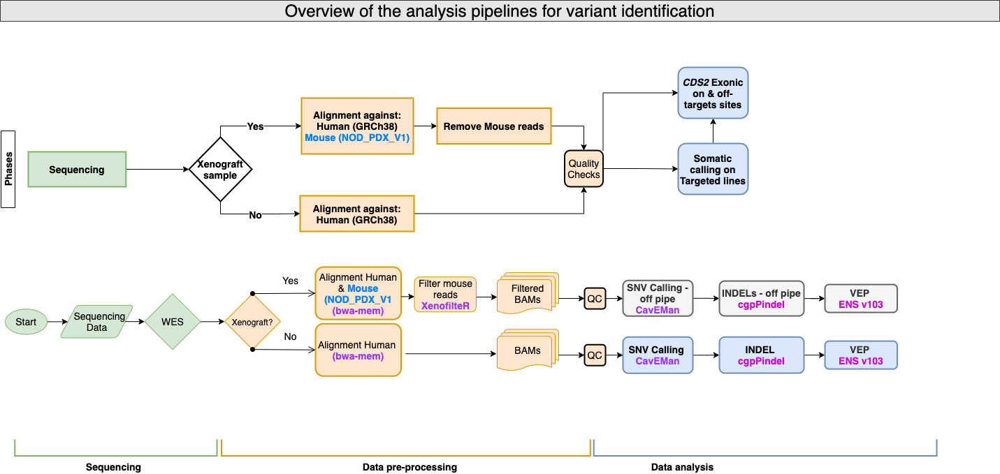

# Analysis of the genetic effects of _CDS2_ targeting - Whole Exome

## Overview 
This repository contains the code used in the identification of single, multi-nucleotide and INDEL variants found in the Whole Exome sequencing data obtained from SW837 and xenografted OMM2.5 cell-lines targeted with CRISPR-Cas9 safe (_STG1_) and _CDS2_ single guide RNAs. These analyses were used to identify on/off-target cutting in the genome of both cell-lines for _Targeting the CDS1/2 axis as a therapeutic strategy in uveal melanoma and pan-cancer_ paper.

## Experimental design

The data analysed with the code in the present repository originates from two different targeting experiments. Two different cancer cell-lines constitutively expressing CRISPR-Cas9 were transduced, with a safe targeting gRNA (_STG1_) or a single gRNA targeting _CDS2_. A short description of the experiments is provided below: 

1. **SW837 _CDS2_ targeting**: This experiment was performed _in vitro_ on the Colorectal adenocarcinoma cancer cell-line SW837. The Cas9 expressing cell-line was infected with either a single gRNA targeting _CDS2_ or a safe targeting gRNA (_STG1_). After being selected in puromycin,  cells were then harvested and the DNA extracted for Whole Exome Sequencing. Data was generated for **three biological replicates** per uninfected, _STG1_ and _CDS2_ targeted SW837 cells groups.

2. **OMM2.5 xenografts**: For this experiment, Uveal Melanoma OMM2.5 - Cas9 cells were transduced with a tet-inducible gRNA construct containing either a _CDS2_ or safe targeting gRNA (_STG1_). Subsequently, cells were grafted for an _in vivo_ growth assessment under different chow regimes; with and without doxycyline. The tumours were then harvested and the DNA extracted for Whole Exome Sequencing. Data was generated for **four biological replicates** for each of the **three** groups of interest. 

The table containing the metadata of all the samples and the experimental group and conditions that each sample belongs to can be found in the (`Group` column) on the [metadata table here](./metadata/7688_3365_sample_exp_metadata.tsv) inside the `metadata` directory. 

## Analysis workflow overview

The analyses were performed using a combination of R, bash and Perl scripts. The workflow depicted below shows the steps followed in the analysis of the sequencing data and the differences required due to the experimental designs.

The overall analysis workflow after the sequencing data was generated was divided into two stages:

2. **Data Pre-processing**: This section includes the alignment to the required reference genome GRCh38 for Human and [NOD_ShiLtJ_V1_PDX](./reference/NOD_ShiLtJ_V1_PDX_ref/README.md) customised mouse reference, and filter of mouse reads from the Human mapped BAM files using **XenofilteR**. Alignment against the Human reference genome was performed in the same way for both datasets. Instructions on how the custom mouse reference and analyses at these stage were performed can be found in the [README here](./documentation/Alignment_and_Filtering_of_mouse_reads_wXenofilteR.md). 

3. **Variant calling and annotation**: This section includes the SNV, MNV and INDEL variant calling, filtering, and variant effect prediction of the variants using negative control lines as normal samples. Resulting variants were collated and VCFs were transformed into a Mutation Annotation Format(MAF) file. Instructions on how the analyses at these stage were performed can be found in the [README here](./documentation/Off-pipe_calling_of_Xenofiltered_WES_data.md)

## Results 
 
All the variants that passed standard filtering criteria and had a Variant Allele Frequency >0.04 were retained. The results  and plots used in the paper are located within the `analysis/somatic_variant_plots` directory. 

To reproduce the results files and plots, please follow the instructions in the [README here](./documentation/Somatic_variant_plotting.md).

## Software dependencies

Analyses were performed using a combination of R, Perl and shell scripts.

- All R scripts were run using `R v4.2.2` and the packaged dependencies for each analysis are detailed within the `renv.lock` file of each analysis folder in the `scripts` directory.
- Perl scripts were run using Perl version `v5.38.0`
- The following software was used:
  - `samtools` version`v1.14` [**here**](https://github.com/samtools/samtools)
  - `bwa-mem` version `0.7.17` [**here**](https://github.com/lh3/bwa)
  - `XenofilteR` version `1.6` [**here**](https://github.com/NKI-GCF/XenofilteR/releases/tag/v1.6)
  - `bcftools` version `1.9` [**here**](https://github.com/samtools/bcftools/)
  - `tabix` version `1.9` [**here**](https://github.com/samtools/tabix/)
  - `CaVEMan` version `1.18.2` [**here**](https://github.com/cancerit/CaVEMan)
  - `cgpCaVEManwrapper` version `1.18.2` [**here**](https://github.com/cancerit/cgpCaVEManWrapper)
  - `Smart-Phase` version `0.1.8`[casm docker image here](https://github.com/cancerit/CASM-Smart-Phase/tree/main)
  - `cgpPindel` version `3.11.0` [**here**](https://github.com/cancerit/cgpPindel)
  - ENSEMBL VEP version `103`[**here**](http://feb2021.archive.ensembl.org/info/docs/tools/vep/index.html)
- The repositories with the scripts used for variant QC and VCF to MAF conversion can be found in the following links:
    - [**QC**](https://github.com/team113sanger/dermatlas_analysis_qc) `v0.4.3`
    - [**MAF**](https://github.com/team113sanger/dermatlas_analysis_maf) `v0.5.4` 

